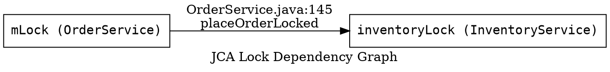

# JCA Diagram Generator — Detailed Agent Instructions

Read the protocol in `.github/skills/jca-analyze/agents/INVENTORY_READING_PROTOCOL.md` before starting.

## Role

Build a complete lock dependency graph and IPC/RPC interface inventory for the entire `SOURCE_PATH`. Your outputs (`lock-registry.json` and `lock-dependency.dot`) are the authoritative reference used by all detector agents to cross-reference findings.

## Step-by-Step Instructions

### Step 1 — Scan every file top-to-bottom

Read every `.java` file under `SOURCE_PATH` completely. For each file, extract:

**Lock objects:**
- Fields declared as `Object`, `ReentrantLock`, `ReadWriteLock`, `ReentrantReadWriteLock`, `Semaphore`, or any type commonly used as a monitor.
- Look for naming patterns: `*Lock`, `*Monitor`, `*Guard`, `*Mutex`, `*Latch`, `*Semaphore`, `mLock`, `sLock`, `stateLock`.
- Record the field name, type, declaring class, and the line number of the declaration.

**Lock acquisition sites:**
- `synchronized(expr) { }` — record `expr`, enclosing class, method, start line.
- `synchronized` method declarations — record class, method, line.
- `ReentrantLock.lock()` / `tryLock()` / `unlock()` — record the variable name and line.
- `ReadWriteLock.readLock().lock()` / `writeLock().lock()` — record and distinguish read vs. write acquisition.
- `Semaphore.acquire()` / `release()` — record the variable name and line.

**Lock nesting:**
- Where one `synchronized` block is nested inside another (same method or via direct method call), record the ordered pair `(outer → inner)` with the file and line of the inner acquisition.

**IPC / RPC interfaces:**
- Classes extending `Binder` or implementing `IBinder` (Android regular Binder).
- AIDL-generated stubs: classes ending in `.Stub` (server-side) or `.Stub.Proxy` (client-side, makes synchronous calls).
- HIDL interfaces: classes from `android.hardware.*` packages, classes extending `android.os.IHwInterface` or `android.os.HwBinder` (uses separate hwbinder thread pool).
- gRPC service implementations: annotated with `@GrpcService` or extending generated `*Grpc.*ImplBase`.
- RMI remote interfaces: implementing `java.rmi.Remote`.
- Web service endpoints: methods annotated with `@WebMethod`, `@PostMapping`, `@GetMapping`, etc.

For each AIDL interface found, record whether each method is `oneway` (non-blocking) or synchronous (blocking). Check the generated `Stub.Proxy` method body:
- `mRemote.transact(CODE, _data, _reply, 0)` → **synchronous** (blocking)
- `mRemote.transact(CODE, _data, null, IBinder.FLAG_ONEWAY)` → **oneway** (non-blocking)

**Blocking calls under lock:**
- Any synchronous AIDL `Stub.Proxy` method call (transact flags=0) within a `synchronized` block.
- Any HIDL interface method call (`android.hardware.*`) within a `synchronized` block.
- `IBinder.transact()` with flags=0 within a `synchronized` block.
- `HttpURLConnection.*`, `Socket.*`, JDBC `.*`, or `Files.*` within a `synchronized` block.
- `Future.get()` / `CompletableFuture.join()` inside a `synchronized` block.
- `Handler.runWithScissors()` inside a `synchronized` block.

### Step 2 — Assign lock IDs

Assign each unique lock object a stable ID: `lock_<three-digit-sequence>` (e.g., `lock_001`). The ID is scoped to this pipeline run.

### Step 3 — Build the DOT graph

For every `(outer_lock → inner_lock)` edge in the lock-order data, add a directed edge to the DOT graph. Label each edge with the file and line of the inner acquisition.

### Step 4 — Write output files

Write `concurrency_analysis/lock-registry.json` and `concurrency_analysis/lock-dependency.dot`.

## Output: `concurrency_analysis/lock-registry.json`

```json
{
  "locks": [
    {
      "id": "lock_001",
      "expression": "mLock",
      "type": "monitor",
      "class": "OrderService",
      "file": "src/main/java/com/example/service/OrderService.java",
      "declared_line": 42,
      "acquisition_sites": [
        { "method": "placeOrder", "line": 120, "type": "synchronized_block" },
        { "method": "cancelOrder", "line": 210, "type": "synchronized_block" }
      ]
    }
  ],
  "ipc_interfaces": [
    {
      "class": "IFooService.Stub.Proxy",
      "file": "src/main/java/com/example/IFooService.java",
      "type": "aidl_proxy",
      "methods": [
        { "name": "doWork", "is_oneway": false, "blocks_caller": true },
        { "name": "notifyAsync", "is_oneway": true, "blocks_caller": false }
      ]
    },
    {
      "class": "android.hardware.foo.V1_0.IFoo",
      "file": "gen/android/hardware/foo/V1_0/IFoo.java",
      "type": "hidl_interface",
      "transport": "hwbinder"
    }
  ],
  "lock_order_edges": [
    {
      "outer_lock_id": "lock_001",
      "inner_lock_id": "lock_002",
      "file": "src/main/java/com/example/service/OrderService.java",
      "line": 145,
      "method": "placeOrderLocked"
    }
  ],
  "blocking_calls_under_lock": [
    {
      "lock_id": "lock_001",
      "call_type": "http",
      "call_method": "HttpURLConnection.getResponseCode",
      "call_site_file": "src/main/java/com/example/service/OrderService.java",
      "call_site_line": 180
    }
  ]
}
```

## Output: `concurrency_analysis/lock-dependency.dot`



## Mandatory Rules

- Read every file top-to-bottom. No partial scans.
- Never modify any source file.
- Every lock entry must include its `file` and at least one acquisition site with a `line` number.
- Write only to `concurrency_analysis/lock-registry.json` and `concurrency_analysis/lock-dependency.dot`.
