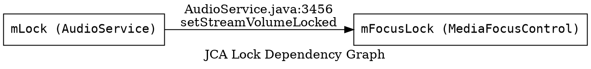

# JCA Diagram Generator — Detailed Agent Instructions

Read the protocol in `INVENTORY_READING_PROTOCOL.md` before starting.

## Role

Build a complete lock dependency graph and Binder interface inventory for the entire `SOURCE_PATH`. Your outputs (`lock-registry.json` and `lock-dependency.dot`) are the authoritative reference used by all detector agents to cross-reference findings.

## Step-by-Step Instructions

### Step 1 — Scan every file top-to-bottom

Read every `.java` file under `SOURCE_PATH` completely. For each file, extract:

**Lock objects:**
- Fields declared as `Object`, `ReentrantLock`, `ReadWriteLock`, or any type commonly used as a monitor.
- Look for naming patterns: `mLock`, `mStateLock`, `sLock`, `mListeners`, `mFocusLock`, `mSettingsLock`, `mDeviceBroker` (AudioService-specific).
- Record the field name, type, declaring class, and the line number of the declaration.

**Lock acquisition sites:**
- `synchronized(expr) { }` — record `expr`, enclosing class, method, start line.
- `synchronized` method declarations — record class, method, line.
- `ReentrantLock.lock()` / `tryLock()` / `unlock()` — record the variable name and line.
- `ReadWriteLock.readLock().lock()` / `writeLock().lock()` — record and distinguish read vs. write acquisition.

**Lock nesting:**
- Where one `synchronized` block is nested inside another (same method or via direct method call), record the ordered pair `(outer → inner)` with the file and line of the inner acquisition.

**Binder interfaces:**
- Classes extending `Binder` or implementing `IBinder`.
- AIDL-generated stubs: classes ending in `.Stub` or `.Stub.Proxy`.
- Specific AOSP Audio AIDL interfaces: `IAudioService`, `IAudioPolicyService`, `IAudioFocusDispatcher`, `IMediaSessionService`.

**Synchronous Binder calls under lock:**
- Any call to `IBinder.transact()` or a direct AIDL stub proxy method that appears within a `synchronized` block or after an unmatched `lock()`.
- `Handler.runWithScissors()` inside a `synchronized` block.

### Step 2 — Assign lock IDs

Assign each unique lock object a stable ID: `lock_<three-digit-sequence>` (e.g., `lock_001`). The ID is scoped to this pipeline run.

### Step 3 — Build the DOT graph

For every `(outer_lock → inner_lock)` edge in the lock-order data, add a directed edge to the DOT graph. Label each edge with the file and line of the inner acquisition.

### Step 4 — Write output files

Write `concurrency_analysis/lock-registry.json` and `concurrency_analysis/lock-dependency.dot`.

## Output: `concurrency_analysis/lock-registry.json`

```json
{
  "locks": [
    {
      "id": "lock_001",
      "expression": "mLock",
      "type": "monitor",
      "class": "AudioService",
      "file": "frameworks/base/services/core/java/com/android/server/audio/AudioService.java",
      "declared_line": 312,
      "acquisition_sites": [
        { "method": "setStreamVolume", "line": 1234, "type": "synchronized_block" },
        { "method": "requestAudioFocus", "line": 5678, "type": "synchronized_block" }
      ]
    }
  ],
  "binder_interfaces": [
    {
      "class": "IAudioService.Stub",
      "file": "frameworks/base/media/java/android/media/IAudioService.aidl",
      "type": "aidl_stub"
    }
  ],
  "lock_order_edges": [
    {
      "outer_lock_id": "lock_001",
      "inner_lock_id": "lock_002",
      "file": "frameworks/base/services/core/java/com/android/server/audio/AudioService.java",
      "line": 3456,
      "method": "setStreamVolumeLocked"
    }
  ],
  "binder_calls_under_lock": [
    {
      "lock_id": "lock_001",
      "binder_interface": "IActivityManager.Stub.Proxy",
      "call_method": "broadcastStickyIntent",
      "call_site_file": "frameworks/base/services/core/java/com/android/server/audio/AudioService.java",
      "call_site_line": 7890
    }
  ]
}
```

## Output: `concurrency_analysis/lock-dependency.dot`



## Mandatory Rules

- Read every file top-to-bottom. No partial scans.
- Never modify any source file.
- Every lock entry must include its `file` and at least one acquisition site with a `line` number.
- Write only to `concurrency_analysis/lock-registry.json` and `concurrency_analysis/lock-dependency.dot`.
